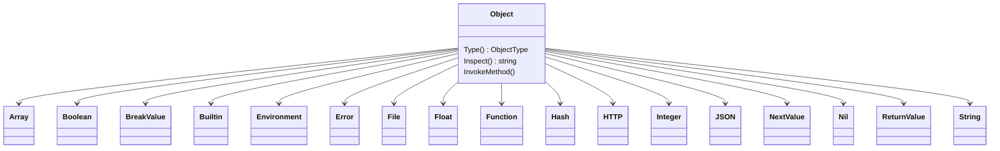
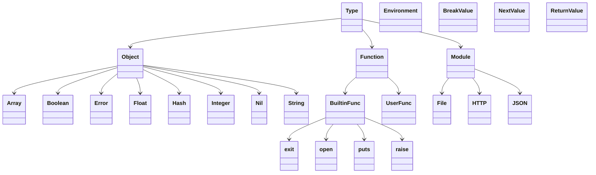

## Current Structure

```mermaid
classDiagram

class Object
Object : Type() ObjectType
Object : Inspect() string
Object : InvokeMethod()

Object --> Array
Object --> Boolean
Object --> BreakValue
Object --> Builtin
Object --> Environment
Object --> Error
Object --> File
Object --> Float
Object --> Function
Object --> Hash
Object --> HTTP
Object --> Integer
Object --> JSON
Object --> NextValue
Object --> Nil
Object --> ReturnValue
Object --> String
```

## Target Structure

```mermaid
classDiagram

class Type

class Function
Type --> Function

class Object
Type --> Object
Object --> Array
Object --> Boolean
Object --> Error
Object --> Float
Object --> Hash
Object --> Integer
Object --> Nil
Object --> String

class BuiltinFunc
Function --> BuiltinFunc
BuiltinFunc --> exit
BuiltinFunc --> open
BuiltinFunc --> puts
BuiltinFunc --> raise


class UserFunc
Function --> UserFunc

class Module
Type --> Module
Module --> File
Module --> HTTP
Module --> JSON

class Environment

class BreakValue
class NextValue
class ReturnValue
```